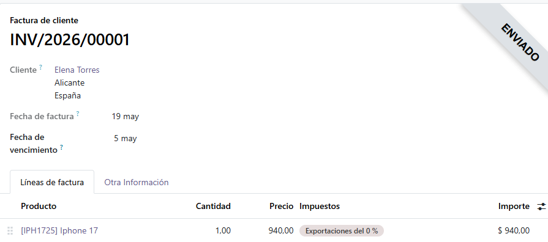

# AEE: Explotación Tecnológica en ERP/CRM

## Generación del Informe Dinámico (QWeb XML)

En este apartado se debe diseñar y programar una estructura XML para la plantilla de un informa de facturas personalizadas para la empresa WillmanTech.S.L. utilizando QWeb.

Para ello se accede a odoo en modo administrador para poder acceder al apartado "tecnico", una vez dentro de este apartado se buscará el apartado vistas y dentro de vistas se buscará mediante clave "invoice" y se entrará en la segunda vista que aparece.

Este archivo que es el que se usará para la personalización. En el traduciremos cada texto que aparece en ingles además de ir personalizando conforme la empresa desee.

Además se comentará cada parte del código para que si a la hora de modificarlo o refactorizarlo sea mucho más facil para el técnico que lo realice.

## Interoperabilidad de Datos (Extracción JSON/XML)

Para este apartado se deberá adjuntar una factura electronica simplificada que cumpla con las especificaciones del estandar UBL (Universal Bussines Language) junto a los nombres de los espacios para los componentes que han sido agregados (cac, bcb...).

Para ello se debe entrar nuevamente en Odoo, pero a diferencia de en el apartado anterior entraremos a las facturas existentes que han sido creadas anteriormente. Se elegirá una de estas y se exportará como xml.
Esto nos dará el archivo xml con el estandar UBL y los nombres de espacios que buscamos. Una vez obtenido se modificarán algunos datos faltantes o que no están correctos del todo.

## 1. Introducción y Arquitectura

Este manual proporciona las instrucciones de explotación, administración y mantenimiento del sistema ERP de **WillmanTech S.L.** El objetivo es garantizar la disponibilidad, integridad y confidencialidad del sistema bajo los estándares de calidad de la norma ISO/IEC/IEEE 26514:2022.

El ERP está compuesto por tres módulos principales interconectados:
* **Módulo Comercial y Clientes (CRM):** Gestión de cuentas, leads, presupuestos y pedidos.
* **Módulo de Facturación y Finanzas:** Emisión de facturas, control de cobros, impuestos y contabilidad automatizada.
* **Módulo de Informes y Analítica:** Renderizado de reportes financieros y operacionales en tiempo real.

El sistema se despliega mediante una arquitectura de microservicios contenedorizados utilizando Docker Compose. Esta estructura aísla los componentes, facilitando la escalabilidad y el mantenimiento.

## 2. Guía de Instalación y Reinstalación

Este apartado describe el procedimiento para levantar el entorno del ERP desde cero en un servidor limpio (Bare Metal o VPS) con arquitectura Linux de 64 bits.

Antes de la instalación, asegúrese de que el servidor cuenta con los siguientes paquetes actualizados:
* **Docker Engine** >= v24.0.0
* **Docker Compose v2** >= v2.20.0
* **SGBD Relacional:** PostgreSQL 15 (Gestionado internamente por el contenedor).

## 3. Seguridad y Control de Acceso
La seguridad del ERP de WillmanTech S.L. se basa en el principio de mínimo privilegio y en el control de acceso basado en roles (RBAC).

| Rol de Usuario | Módulo Comercial (CRM) | Módulo Facturación | Configuración del Sistema |
| :--- | :---: | :---: | :---: |
| **Administrador (SysAdmin)** | Acceso Total (RWD) | Acceso Total (RWD) | Acceso Total (RWD) |
| **Contable / Gestor** | Solo Lectura (R) | Acceso Total (RWD) | Sin Acceso (N) |
| **Comercial** | Acceso Total (RWD) | Solo Creación de Presupuestos (W) | Sin Acceso (N) |

Para mitigar riesgos de accesos no autorizados o ataques de fuerza bruta, el submódulo de autenticación fuerza de forma nativa los siguientes requisitos de directiva de grupo:
* **Longitud Mínima:** Las contraseñas deben tener un mínimo de 12 caracteres.
* **Complejidad Requerida:** Inclusión obligatoria de al menos una letra mayúscula, una letra minúscula, un dígito numérico y un carácter especial (ej. `@`, `#`, `$`, `%`, `*`).
* **Rotación Forzada:** Caducidad automática de credenciales cada 90 días naturales. El sistema impedirá la reutilización de las últimas 3 contraseñas.
* **Política de Bloqueo (Lockout):** Tras 5 intentos fallidos consecutivos en un intervalo de 15 minutos, la cuenta de usuario se suspenderá automáticamente. Solo un Administrador podrá desbloquear la cuenta o, en su defecto, se liberará automáticamente pasadas 24 horas.

## 4. Procedimiento de Backup y Restauración
El Plan de Continuidad de Negocio de WillmanTech S.L. exige mantener copias de seguridad consistentes tanto del estado transaccional (Base de Datos Relacional) como del estado físico (Almacén de Archivos Adjuntos).

El respaldo se realiza en caliente utilizando la herramienta nativa pg_dump orientada al contenedor de persistencia, garantizando la integridad referencial sin necesidad de interrumpir el servicio de la aplicación.

## 5. Flujo Operativo de Facturación e Informes

El ciclo operativo para la emisión de un comprobante legal sigue una secuencia lineal e intuitiva diseñada para evitar errores humanos:

Navegación: El usuario con rol Contable o Administrador accede al menú lateral izquierdo y hace clic en Facturación > Nueva Factura.

Selección de Entidad: Al escribir las primeras letras del cliente en el buscador dinámico, el sistema realiza una llamada asíncrona mediante AJAX para autocompletar la ficha fiscal (Razón Social, NIF/CIF, Dirección de Facturación y Términos de Pago).

Carga de Conceptos: Se añaden las líneas de detalle introduciendo el artículo/servicio, la cantidad y el precio unitario. Los impuestos aplicables (IVA, IRPF, Recargo de Equivalencia) se calculan y desglosan en tiempo real en el pie del formulario.

Confirmación y Persistencia: El usuario presiona el botón "Confirmar y Emitir Factura". El sistema valida que el documento contenga campos obligatorios coherentes, le asigna un número correlativo único e inalterable según la serie contable, y guarda el registro con estado EMITIDA en PostgreSQL.

## Consultas IA

#1 
### Agente:
Claude Haiku 4.5
### Propmt:
Añade los comentarios faltantes a este archivo arriba de los if/else desglosando la funcionalidad de cada uno.
### Respuesta textual:
Ha resuelto el prompt escribiendo comentarios en el xml explicando algunos if/else
